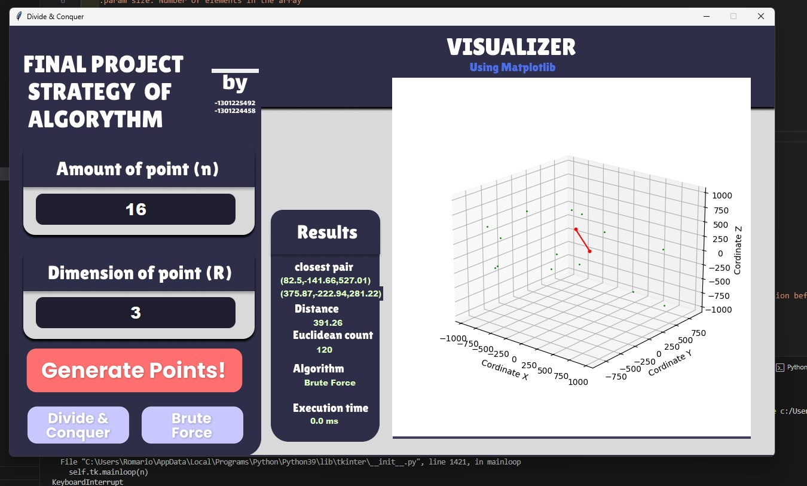

# Finding the Closest Pair of Points in 3D with the Divide and Conquer Algorithm and Brute Force


Finding the closest pair of points with the Divide and Conquer algorithm has been explained in the lecture. The problem is formulated for points on a flat plane (2D). In this Assignment 2, you are asked to develop an algorithm to find the closest pair of points on a 3D plane. Suppose there are n points in 3D space. Each point P in space is represented by coordinates P = (x, y, z). Find the pair of points that are closest to each other. The distance between two points P1 = (x1, y1, z1) and P2 = (x2, y2, z2) is calculated using the following Euclidean formula:
$$

d = \sqrt{(x_2 - x_1)^2 + (y_2 - y_1)^2 + (z_2 - z_1)^2}
$$

## Group Members
| NIM        | Name                                | Tugas                                   |
| --------   | ---------------------------         |-----------------------------------------|
| 1301225492 | Romario Viegas Francisco Marcal     | Divide and Conquer algorithm, I/O, GUI  |
| 1301224458 | Ari Ramadhan                        | Brute Force algorithm                  |

## About this project
- Solves closest pair problem in 3D or up with either brute force or divide and conquer algorithm.
- GUI display implemented using `tkinter`
- Asks for number of points and dimension beforehand to generate random points
- Programmed in `python v.3.10.9` or up

## Features

The features below are 100% done and implemented.
- Brute-Force algorithm solution
- Divide and Conquer algorithm solution
- Both algorithm generalized up to the N-th dimension
- A simple and working GUI

## Requirements
- Latest `Python 3` version
- `matplotlib`
- `tkinter`

## Setup
Make sure all requirements are installed in your local machine beforehand. Then, clone this repository.
```bash
git clone https://github.com/Mr-Roma/Final-Project-Strategy-Algorythm.git
```

## Program Structure

```
│ README.md
│ .gitignore
│
└─── src
      ├─ assets
      │    ├─ button_1.png
      │    ├─ button_2.png
      │    ├─ button_3.png
      │    ├─ button_4.png
      │    ├─ entry_1.png
      │    ├─ entry_2.png
      │    └─ image_1.png
      ├─ bruteForce.py
      ├─ displayCoordinate.py
      ├─ divideAndConquer.py
      ├─ generateCoordinate.py
      ├─ main.py
      ├─ mainWindows.py
      └─ utilities.py
```